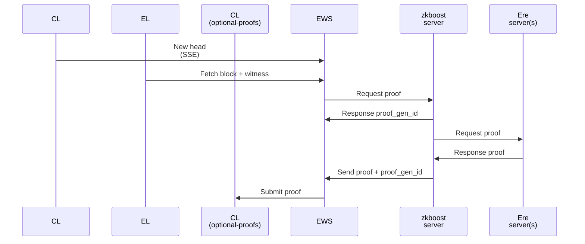

# Local Testnet with EWS

This example shows how to run a small local testnet with 3 normal nodes, and 3 optional-proofs nodes, with zkboost generating EL execution proofs, and EWS (Execution Witness Sentry) publish the proofs (configured to have 2 proof types `ethrex-zisk` and `reth-zisk`).



## Installation

1. Install [Docker](https://docs.docker.com/get-docker/). Verify that Docker has been successfully installed by running `sudo docker run hello-world`. 

1. Install [Kurtosis](https://docs.kurtosis.com/install/). Verify that Kurtosis has been successfully installed by running `kurtosis version` which should display the version.

1. Install [`yq`](https://github.com/mikefarah/yq). If you are on Ubuntu, you can install `yq` by running `snap install yq`.

## (Optional) Build image locally with GPU acceleration

The pre-built ZisK prover image (`ghcr.io/eth-act/ere/ere-server-zisk:0.3.0-cuda`) supports Blackwell GPUs only (ZisK only supports single architecture codegen). If you have a Blackwell GPU, e.g. RTX 50 series or RTX PRO 6000, skip this section.

Build the image with the compute capability of local GPU:

```bash
git clone --depth 1 --branch v0.3.0 https://github.com/eth-act/ere
cd ere
CUDA_ARCH=$(nvidia-smi --query-gpu=compute_cap --format=csv,noheader | head -1 | tr -d '.')
echo "Building for CUDA architecture: $CUDA_ARCH"
bash .github/scripts/build-image.sh \
    --registry ghcr.io/eth-act/ere \
    --zkvm zisk \
    --tag 0.3.0-cuda \
    --base \
    --server \
    --cuda \
    --cuda-archs "$CUDA_ARCH"
```

This produces `ghcr.io/eth-act/ere/ere-server-zisk:0.3.0-cuda`, which is referenced by the `./docker/example/testnet/docker-compose.yml`.

## Start local testnet

In `zkboost` repo:

```
./docker/example/testnet/start_local_testnet.sh -n ./docker/example/testnet/network_params_mixed_proof_gen_verify.yaml
```

## Start zkboost and EWS

Configure the GPU resoure in `./docker/example/testnet/docker-compose.yml`, by default it assumes 8 GPUs are available, and distributes 4 to each prover.

In `zkboost` repo:

```
docker compose -f ./docker/example/testnet/docker-compose.yml build
docker compose -f ./docker/example/testnet/docker-compose.yml up -d
```

## Stop local testnet

In `zkboost` repo:

```
./docker/example/testnet/stop_local_testnet.sh
```

## Stop zkboost and EWS

In `zkboost` repo:

```
docker compose -f ./docker/example/testnet/docker-compose.yml down
```
