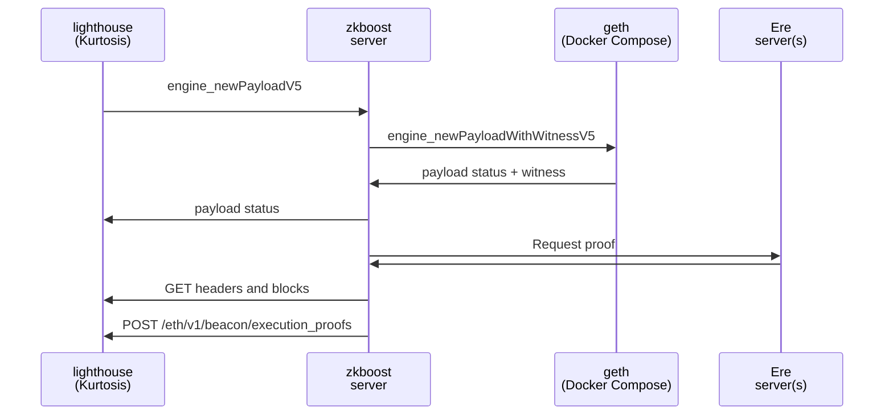

# Local Testnet with zkboost

This example runs a local Kurtosis testnet with geth and lighthouse. Gloas is active from genesis. zkboost runs beside it with two Ere GPU provers for `ethrex-zisk` and `reth-zisk`. A lighthouse built from the `optional-proofs-gloas` branch of [eth-act/lighthouse](https://github.com/eth-act/lighthouse) uses zkboost as its Engine API endpoint.

zkboost forwards every request to a dedicated Geth started by Docker Compose. It obtains the execution witness of every valid payload and proves that payload.


```mermaid
sequenceDiagram
    participant CL as lighthouse <br> (Kurtosis)
    participant zkboost as zkboost <br> server
    participant EL as geth <br> (Docker Compose)
    participant Ere as Ere <br> server(s)
    CL->>zkboost: engine_newPayloadV5 <br>
    zkboost->>EL: engine_newPayloadWithWitnessV5
    EL->>zkboost: payload status + witness
    zkboost->>CL: payload status
    zkboost->>Ere: Request proof
    Ere->>zkboost:
    zkboost->>CL: GET headers and blocks
    zkboost->>CL: POST /eth/v1/beacon/execution_proofs
```

## Testnet layout

| Participants | Role |
| --- | --- |
| First two | Geth and Lighthouse block producers, holding two thirds of the stake. |
| Third | eth-act Lighthouse; follows gossip and executes through zkboost and the Compose Geth. |

The third Lighthouse uses the proof-engine verifying keys in `network_params.yaml`. zkboost signs proofs as **validator 256**, using the keystore in `docker/example/testnet/validator-keys`, and submits them to this Lighthouse.

### Networking

Compose services share the project-scoped `zkboost` network. Geth and zkboost also join the enclave network.

| Connection | Address |
| --- | --- |
| Lighthouse → zkboost | `zkboost:3000` |
| zkboost → Geth | `geth:8551` |
| zkboost → Lighthouse | `cl-3-lighthouse:4000` |

### Dedicated Geth

- Uses the enclave genesis and syncs missing history from the first testnet Geth.
- `start_geth.sh` takes the peer RPC URL, fetches its enode, and writes the peer config and testnet JWT secret.
- Needs no fixed node key. Its Engine API has no published host port.
- All Kurtosis Lighthouse nodes keep running.

## Not ready

The example runs the Engine API flow and the proof delivery end to end. lighthouse accepts every envelope, checks the validator signature, and its proof engine rejects every proof with `InvalidProof`.

- lighthouse has a newer ere verifier than the provers, so it rejects their proofs. lighthouse also knows the proof types of the reth guests only.
- The public values that the [proof engine](https://github.com/eth-act/lighthouse/blob/a62a9709da55d98664f4d903e75041f71aae23d8/beacon_node/proof_engine/src/ere/mod.rs#L45-L67) of lighthouse expects differ from the output of the guests.

## Installation

1. Install [Docker](https://docs.docker.com/get-docker/). Run `sudo docker run hello-world` to check the installation.

1. Install [Kurtosis](https://docs.kurtosis.com/install/). Run `kurtosis version` to check the installation.

1. Install [`yq`](https://github.com/mikefarah/yq). On Ubuntu, `snap install yq` installs it.

## (Optional) Build image locally with GPU acceleration

The pre-built ZisK prover image (`ghcr.io/eth-act/ere/ere-server-zisk:0.17.0-cuda`) supports Blackwell GPUs only (ZisK only supports single architecture codegen). If you have a Blackwell GPU, for example RTX 50 series or RTX PRO 6000, skip this section.

Build the image with the compute capability of local GPU:

```bash
git clone --depth 1 --branch v0.17.0 https://github.com/eth-act/ere
cd ere
CUDA_ARCH=$(nvidia-smi --query-gpu=compute_cap --format=csv,noheader | head -1 | tr -d '.')
echo "Building for CUDA architecture: $CUDA_ARCH"
bash .github/scripts/build-image.sh \
    --registry ghcr.io/eth-act/ere \
    --zkvm zisk \
    --tag 0.17.0-cuda \
    --base \
    --server \
    --cuda \
    --cuda-archs "$CUDA_ARCH"
```

This produces `ghcr.io/eth-act/ere/ere-server-zisk:0.17.0-cuda`. The compose file references this image.

## Start local testnet

The start script:

- Saves the enclave genesis for the dedicated Geth.
- Builds `lighthouse:eth-act-optional-proofs-gloas` from the eth-act branch. This takes several minutes; pass `-b false` to reuse an existing image.

### Enclave settings

- **Name:** defaults to `local-testnet`. To change it, export `ENCLAVE_NAME` before running the scripts and Compose.
- **Genesis:** saved to `docker/scripts/genesis-${ENCLAVE_NAME}.json` and mounted automatically.

In `zkboost` repo:

```
./docker/scripts/start_local_testnet.sh
```

## Start zkboost and provers

After recreating the testnet, recreate the Compose Geth container too: its chain data lives in the container.

Set the GPU devices in `docker-compose.yml`. The default assigns GPUs 0 to 3 to `ethrex-zisk` and 4 to 7 to `reth-zisk`.

In `zkboost` repo:

```
docker compose -f ./docker/example/testnet/docker-compose.yml build
docker compose -f ./docker/example/testnet/docker-compose.yml up -d
```

### Check progress

- **Dashboard:** http://localhost:3000/dashboard.
- **Execution:** the third Lighthouse logs `exec_hash: ... (verified)` for payloads executed through zkboost.
- **Proof delivery:** zkboost logs `proof submitted` or `proof submission failed`, including the Lighthouse reason.

## Stop zkboost

In `zkboost` repo:

```
docker compose -f ./docker/example/testnet/docker-compose.yml down
```

## Stop local testnet

The Compose services stop first, because Kurtosis removes the enclave network while the Compose containers are attached to it.

In `zkboost` repo:

```
./docker/scripts/stop_local_testnet.sh
```
