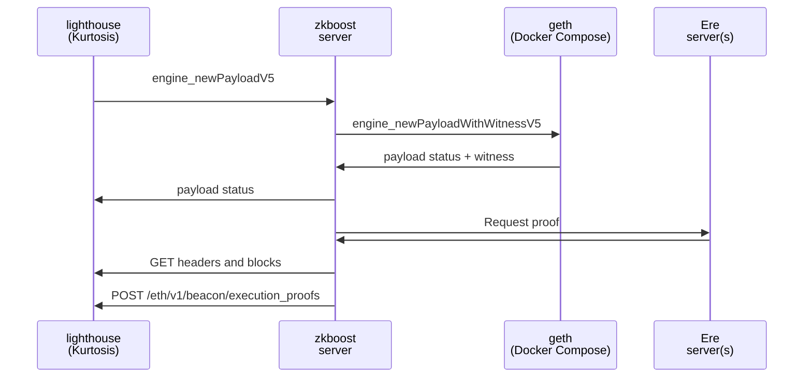

# Local Testnet with zkboost

This example runs a local Kurtosis testnet with geth and lighthouse. Gloas is active from genesis. zkboost runs beside it with two Ere GPU provers for `ethrex-zisk` and `reth-zisk`. A lighthouse built from the `optional-proofs-gloas` branch of [eth-act/lighthouse](https://github.com/eth-act/lighthouse) uses zkboost as its Engine API endpoint.

zkboost forwards every request to a dedicated Geth started by Docker Compose. It obtains the execution witness of each valid payload and requests a proof.


```mermaid
sequenceDiagram
    participant CL as lighthouse <br> (Kurtosis)
    participant zkboost as zkboost <br> server
    participant EL as geth <br> (Docker Compose)
    participant Ere as Ere <br> server(s)
    CL->>zkboost: engine_newPayloadV5 <br>
    zkboost->>EL: engine_newPayloadWithWitnessV5
    EL->>zkboost: payload status + witness
    zkboost->>CL: payload status
    zkboost->>Ere: Request proof
    Ere->>zkboost:
    zkboost->>CL: GET headers and blocks
    zkboost->>CL: POST /eth/v1/beacon/execution_proofs
```

## Testnet layout

| Participants | Role                                                                                     |
| ------------ | ---------------------------------------------------------------------------------------- |
| First two    | Geth and Lighthouse block producers with two thirds of the stake.                        |
| Third        | eth-act Lighthouse. It follows gossip and executes through zkboost and the Compose Geth. |

The third Lighthouse uses the proof-engine verifying keys in `network_params.yaml`. zkboost signs proofs as validator 256 with the keystore in `docker/example/testnet/validator-keys` and submits them to this Lighthouse.

### Networking

Compose services share the project-scoped `zkboost` network. Geth and zkboost also join the enclave network.

| Connection            | Address                |
| --------------------- | ---------------------- |
| Lighthouse to zkboost | `zkboost:3000`         |
| zkboost to Geth       | `geth:8551`            |
| zkboost to Lighthouse | `cl-3-lighthouse:4000` |

### Dedicated Geth

- Uses the enclave genesis and syncs missing history from the first testnet Geth.
- `start_geth.sh` takes the peer RPC URL, fetches its enode, and writes the peer config and testnet JWT secret.
- Needs no fixed node key. Its Engine API has no published host port.
- All Kurtosis Lighthouse nodes keep running.

## Compatibility

The start script builds Lighthouse from the tip of `optional-proofs-gloas`. Commit [`12702b39e`](https://github.com/eth-act/lighthouse/commit/12702b39e565c8827e90e14a100bff1d2ed308d5) and later commits of the branch are compatible with this example. An older image with the same tag can contain an incompatible verifier. Rebuild it before you pass `-b false`.

The third Lighthouse executes every payload through zkboost and verifies the submitted proofs. The example runs no proof-only node and no proof gossip between proof-enabled nodes. The other two Lighthouse nodes do not subscribe to execution proofs. Lighthouse therefore logs `NoPeersSubscribedToTopic` for `execution_proof` after a successful local verification.

## Installation

1. Install [Docker](https://docs.docker.com/get-docker/). Run `sudo docker run hello-world` to check the installation.

1. Install [Kurtosis](https://docs.kurtosis.com/install/). Run `kurtosis version` to check the installation.

1. Install [`yq`](https://github.com/mikefarah/yq). On Ubuntu, `snap install yq` installs it.

## Start local testnet

Run every command from the repository root.

The start script builds `lighthouse:eth-act-optional-proofs-gloas` from the eth-act branch, starts the enclave, and saves the enclave genesis for the dedicated Geth. The image build takes several minutes. Pass `-b false` to reuse an existing image.

- The enclave name defaults to `local-testnet`. To change it, export `ENCLAVE_NAME` before you run the scripts and Compose.
- The genesis is saved to `docker/scripts/genesis-${ENCLAVE_NAME}.json` and mounted automatically.

```
./docker/scripts/start_local_testnet.sh
```

## Start zkboost and provers

After you recreate the testnet, also recreate the Compose Geth container. Its chain data lives in the container.

Set the GPU devices in `docker-compose.yml`. The default assigns GPUs 0 to 3 to `ethrex-zisk` and 4 to 7 to `reth-zisk`.

```
docker compose -f ./docker/example/testnet/docker-compose.yml build
docker compose -f ./docker/example/testnet/docker-compose.yml up -d
```

### Check progress

- The dashboard is at http://localhost:3000/dashboard.
- zkboost logs `received new payload` and then `proof dispatched` for each payload. The third Lighthouse reports `is_optimistic: false` and `el_offline: false` at `/eth/v1/node/syncing`. Its Gloas status log can show `exec_hash: "n/a"`. Use the two checks below for proof verification.
- zkboost logs `proof submitted` with `proof_type=ethrex-zisk` and `proof_type=reth-zisk` after Lighthouse accepts the signed proofs. A `proof submission failed` log includes the Lighthouse reason.
- Query `GET /eth/v1/beacon/execution_proofs/{block_id}` on the third Lighthouse with the root or slot of the proven block. A `data` entry with proof type `"3"` or `"6"` shows that Lighthouse cached the proof. Query soon after the submission, because the cache is bounded. The `head` block can be newer than the proven block.

For example (replace `3` with a proven slot in your run):

```bash
SLOT="3"
BEACON_API=$(kurtosis port print "${ENCLAVE_NAME:-local-testnet}" cl-3-lighthouse http)
curl -fsS "$BEACON_API/eth/v1/beacon/execution_proofs/$SLOT" \
  | yq -p=json '.data[] | {"proof_type": .message.proof_type, "validator_index": .validator_index, "beacon_block_root": .message.beacon_block_root}'
```

## Stop

1. Run `docker compose -f ./docker/example/testnet/docker-compose.yml down`.
2. Run `./docker/scripts/stop_local_testnet.sh`.
