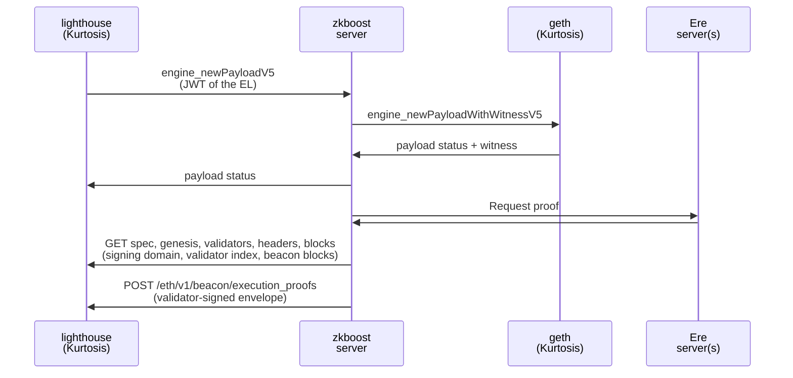

# Local Testnet with zkboost

This example runs a local Kurtosis testnet with geth and lighthouse. Gloas is active from genesis. zkboost runs beside it with two Ere GPU provers for `ethrex-zisk` and `reth-zisk`. A lighthouse built from the `optional-proofs-gloas` branch of [eth-act/lighthouse](https://github.com/eth-act/lighthouse) uses zkboost as its Engine API endpoint. zkboost forwards every request to a geth of the testnet, obtains the execution witness of every valid payload, and proves it.


```mermaid
sequenceDiagram
    participant CL as lighthouse <br> (Kurtosis)
    participant zkboost as zkboost <br> server
    participant EL as geth <br> (Kurtosis)
    participant Ere as Ere <br> server(s)
    CL->>zkboost: engine_newPayloadV5 <br> (JWT of the EL)
    zkboost->>EL: engine_newPayloadWithWitnessV5
    EL->>zkboost: payload status + witness
    zkboost->>CL: payload status
    zkboost->>Ere: Request proof
    Ere->>zkboost:
    zkboost->>CL: GET spec, genesis, validators, headers, blocks <br> (signing domain, validator index, beacon blocks)
    zkboost->>CL: POST /eth/v1/beacon/execution_proofs <br> (validator-signed envelope)
```

The testnet has four participants.

- The first and the third participant produce the blocks.
- The second participant is the eth-act lighthouse without an EL of its own. It follows the chain over gossip and executes every payload through zkboost on the fourth geth. zkboost signs every proof as its first validator, 128, with the keystore under `docker/example/testnet/validator-keys`, and posts it to `POST /eth/v1/beacon/execution_proofs` of this lighthouse. Its proof engine runs with the verifying keys of the reth guests of the ere-guests v0.17.0 release, the guests of the provers, from `network_params.yaml`. It cannot share a participant with a geth, because ethereum-package sets `--execution-endpoints` to the paired EL and lighthouse accepts the flag once.
- The fourth participant has the geth behind zkboost. The start script stops its lighthouse, because geth answers a payload it already knows with `VALID` and no witness. This participant is a workaround. The witness proposal in [execution-apis PR 885](https://github.com/ethereum/execution-apis/pull/885) requires the witness for every `VALID` response, including known payloads. Once geth follows it, zkboost can share the geth of the first participant.

The Docker Compose services join the enclave network of the testnet, so lighthouse reaches zkboost as `zkboost`, and zkboost reaches geth and lighthouse by their Kurtosis service names.

## Not ready

The example runs the Engine API flow and the proof delivery end to end. lighthouse accepts every envelope, checks the validator signature, and runs its proof engine, which rejects every proof with `InvalidProof`. Two mismatches remain.

- The ere verifier of lighthouse is v0.18.0, with Zisk v1.2.0-alpha and SP1 v6.6.0. The provers run ere v0.17.0 with the guests of the ere-guests v0.17.0 release, built for Zisk v1.1.0-alpha and SP1 v6.4.0, so their `reth-zisk` proofs do not match the verifier. OpenVM is v2.1.0-preview in both, and the v0.18.0 verifier accepts a v0.17.0 OpenVM proof of the same key. lighthouse knows the proof types 1 to 3 of the reth guests only, so the `ethrex-zisk` envelopes of proof type 6 are rejected as unsupported.
- The public values that lighthouse expects are not compatible with the guests of execution-specs. Its [proof engine](https://github.com/eth-act/lighthouse/blob/a62a9709da55d98664f4d903e75041f71aae23d8/beacon_node/proof_engine/src/ere/mod.rs#L45-L67) compares the guest output with `hash_tree_root(PublicInput)` followed by zeros. The guests commit the 43-byte `StatelessValidationResult`, whose request root differs as well, because they hash `NewPayloadRequest` as a plain container with a progressive list of versioned hashes while lighthouse hashes a progressive container with a bounded list.

## Installation

1. Install [Docker](https://docs.docker.com/get-docker/). Run `sudo docker run hello-world` to check the installation.

1. Install [Kurtosis](https://docs.kurtosis.com/install/). Run `kurtosis version` to check the installation.

1. Install [`yq`](https://github.com/mikefarah/yq). On Ubuntu, `snap install yq` installs it.

## (Optional) Build image locally with GPU acceleration

The pre-built ZisK prover image (`ghcr.io/eth-act/ere/ere-server-zisk:0.17.0-cuda`) supports Blackwell GPUs only (ZisK only supports single architecture codegen). If you have a Blackwell GPU, e.g. RTX 50 series or RTX PRO 6000, skip this section.

Build the image with the compute capability of local GPU:

```bash
git clone --depth 1 --branch v0.17.0 https://github.com/eth-act/ere
cd ere
CUDA_ARCH=$(nvidia-smi --query-gpu=compute_cap --format=csv,noheader | head -1 | tr -d '.')
echo "Building for CUDA architecture: $CUDA_ARCH"
bash .github/scripts/build-image.sh \
    --registry ghcr.io/eth-act/ere \
    --zkvm zisk \
    --tag 0.17.0-cuda \
    --base \
    --server \
    --cuda \
    --cuda-archs "$CUDA_ARCH"
```

This produces `ghcr.io/eth-act/ere/ere-server-zisk:0.17.0-cuda`. The compose file references this image.

## Start local testnet

The script builds the eth-act lighthouse image `lighthouse:eth-act-optional-proofs-gloas` from the branch, which takes several minutes. Pass `-b false` to reuse an existing image.

In `zkboost` repo:

```
./docker/example/testnet/start_local_testnet.sh
```

## Start zkboost and provers

Set the GPU devices in `docker-compose.yml`. The default assigns GPUs 0 to 3 to `ethrex-zisk` and 4 to 7 to `reth-zisk`.

In `zkboost` repo:

```
docker compose -f ./docker/example/testnet/docker-compose.yml build
docker compose -f ./docker/example/testnet/docker-compose.yml up -d
```

The dashboard of zkboost is served at http://localhost:3000/dashboard. The second lighthouse logs `exec_hash: ... (verified)` for every payload executed through zkboost. The proof verdicts appear in the zkboost log as `proof submitted` or `proof submission failed` with the lighthouse reason.

## Stop local testnet

In `zkboost` repo:

```
./docker/example/testnet/stop_local_testnet.sh
```

## Stop zkboost

In `zkboost` repo:

```
docker compose -f ./docker/example/testnet/docker-compose.yml down
```
