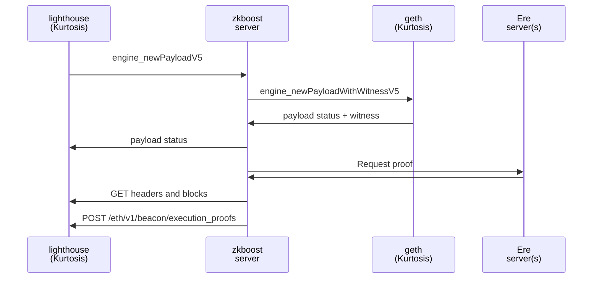

# Local Testnet with zkboost

This example runs a local Kurtosis testnet with geth and lighthouse. Gloas is active from genesis. zkboost runs beside it with two Ere GPU provers for `ethrex-zisk` and `reth-zisk`. A lighthouse built from the `optional-proofs-gloas` branch of [eth-act/lighthouse](https://github.com/eth-act/lighthouse) uses zkboost as its Engine API endpoint.

zkboost forwards every request to a geth of the testnet. It obtains the execution witness of every valid payload and proves that payload.


```mermaid
sequenceDiagram
    participant CL as lighthouse <br> (Kurtosis)
    participant zkboost as zkboost <br> server
    participant EL as geth <br> (Kurtosis)
    participant Ere as Ere <br> server(s)
    CL->>zkboost: engine_newPayloadV5 <br>
    zkboost->>EL: engine_newPayloadWithWitnessV5
    EL->>zkboost: payload status + witness
    zkboost->>CL: payload status
    zkboost->>Ere: Request proof
    Ere->>zkboost:
    zkboost->>CL: GET headers and blocks
    zkboost->>CL: POST /eth/v1/beacon/execution_proofs
```

The testnet has three participants.

- The first participant produces the blocks. Its 256 validators hold two thirds of the stake, so the chain finalizes while the node behind zkboost is offline.
- The second participant is the eth-act lighthouse without an EL of its own. It follows the chain over gossip and executes every payload through zkboost on the third geth. Its proof engine uses the verifying keys from `network_params.yaml`. zkboost signs every proof as validator 256 with the keystore under `docker/example/testnet/validator-keys` and posts it to this lighthouse.
- The third participant has the geth behind zkboost and no validators. The start script stops its lighthouse, because geth returns no witness for a payload it already knows.

The Docker Compose services join the enclave network of the testnet. lighthouse reaches zkboost as `zkboost`, and zkboost reaches geth and lighthouse by their Kurtosis service names.

## Not ready

The example runs the Engine API flow and the proof delivery end to end. lighthouse accepts every envelope, checks the validator signature, and its proof engine rejects every proof with `InvalidProof`.

- lighthouse has a newer ere verifier than the provers, so it rejects their proofs. lighthouse also knows the proof types of the reth guests only.
- The public values that the [proof engine](https://github.com/eth-act/lighthouse/blob/a62a9709da55d98664f4d903e75041f71aae23d8/beacon_node/proof_engine/src/ere/mod.rs#L45-L67) of lighthouse expects differ from the output of the guests.

## Installation

1. Install [Docker](https://docs.docker.com/get-docker/). Run `sudo docker run hello-world` to check the installation.

1. Install [Kurtosis](https://docs.kurtosis.com/install/). Run `kurtosis version` to check the installation.

1. Install [`yq`](https://github.com/mikefarah/yq). On Ubuntu, `snap install yq` installs it.

## (Optional) Build image locally with GPU acceleration

The pre-built ZisK prover image (`ghcr.io/eth-act/ere/ere-server-zisk:0.17.0-cuda`) supports Blackwell GPUs only (ZisK only supports single architecture codegen). If you have a Blackwell GPU, for example RTX 50 series or RTX PRO 6000, skip this section.

Build the image with the compute capability of local GPU:

```bash
git clone --depth 1 --branch v0.17.0 https://github.com/eth-act/ere
cd ere
CUDA_ARCH=$(nvidia-smi --query-gpu=compute_cap --format=csv,noheader | head -1 | tr -d '.')
echo "Building for CUDA architecture: $CUDA_ARCH"
bash .github/scripts/build-image.sh \
    --registry ghcr.io/eth-act/ere \
    --zkvm zisk \
    --tag 0.17.0-cuda \
    --base \
    --server \
    --cuda \
    --cuda-archs "$CUDA_ARCH"
```

This produces `ghcr.io/eth-act/ere/ere-server-zisk:0.17.0-cuda`. The compose file references this image.

## Start local testnet

The script builds the eth-act lighthouse image `lighthouse:eth-act-optional-proofs-gloas` from the branch, which takes several minutes. Pass `-b false` to reuse an existing image.

In `zkboost` repo:

```
./docker/example/testnet/start_local_testnet.sh
```

## Start zkboost and provers

Set the GPU devices in `docker-compose.yml`. The default assigns GPUs 0 to 3 to `ethrex-zisk` and 4 to 7 to `reth-zisk`.

In `zkboost` repo:

```
docker compose -f ./docker/example/testnet/docker-compose.yml build
docker compose -f ./docker/example/testnet/docker-compose.yml up -d
```

The dashboard of zkboost is served at http://localhost:3000/dashboard. The second lighthouse logs `exec_hash: ... (verified)` for every payload executed through zkboost. The proof verdicts appear in the zkboost log as `proof submitted` or `proof submission failed` with the lighthouse reason.

## Stop zkboost

In `zkboost` repo:

```
docker compose -f ./docker/example/testnet/docker-compose.yml down
```

## Stop local testnet

The Compose services stop first, because Kurtosis removes the enclave network while the Compose containers are attached to it.

In `zkboost` repo:

```
./docker/example/testnet/stop_local_testnet.sh
```
